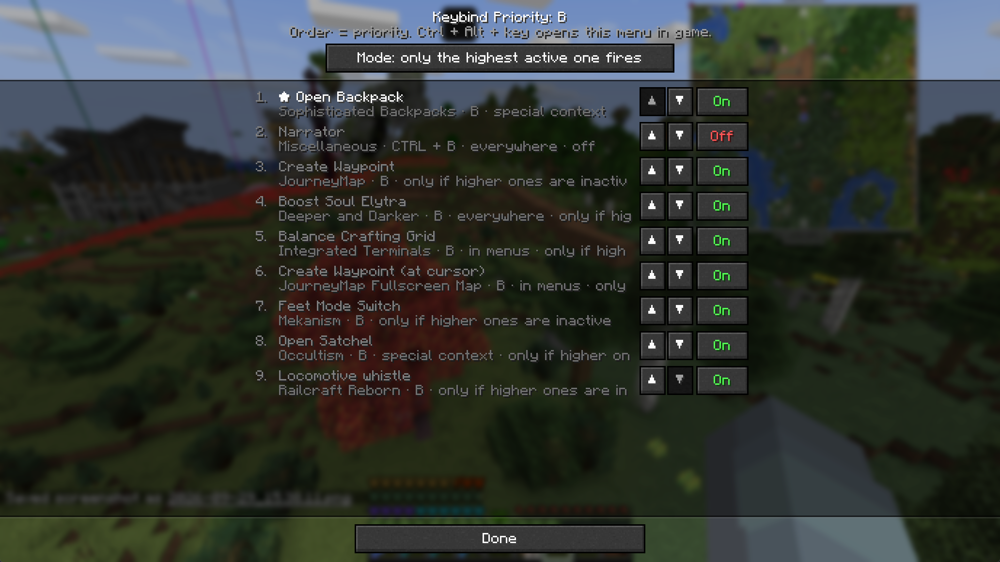

# Keybind Priority

**[Download on Modrinth](https://modrinth.com/mod/keybind-priority)** · NeoForge · Minecraft 1.21 – 1.21.11 · client only

Ever played a big modpack and pressed **V**, expecting to vein mine, and got the voice chat menu instead? Or
both at once?

Big packs run out of keys fast. In All the Mods 10, **C** is bound thirteen times out of the box. **H** eleven
times. **R** ten. NeoForge doesn't pick one when you press a key like that. It triggers all of them, and you
get whatever happens.

Your options so far: open the controls screen, scroll through 400 bindings, rebind half of them to keys you'll
never remember, and do it again after the next pack update.

**Keybind Priority lets you rank them instead.**

## How it works

Stand in the world, hold **Ctrl + Alt** and press the key that's causing trouble.

You get a list of everything bound to that key, with the mod's category, any modifier and where it applies.
Put the one you actually want at the top and switch the mode to **"top binding only"**. That's it. V vein
mines again, and voice chat keeps its binding but stops answering to V.

- **⤒ ▲ ▼** set the order. Top wins.
- **On / Off** silences one binding on this key without unbinding it.
- **Mode** switches between "all bindings" (the normal NeoForge behaviour) and "top binding only".

Each row shows its state at a glance: **active**, **backup** (waits behind a higher binding), **off**,
**needs item** or **preferred** (an item condition moved it up). The first time you open the menu, a short
five-page guide explains all of this; the **?** button brings it back.

Priority rules only apply while a world is loaded and no screen or overlay is open. Inventories, chat,
other menus and the title screen keep their normal keybind behaviour, including bindings marked Off.
During gameplay, a binding with an inactive context or modifier is skipped and the next one takes over.

Nothing is rebound, nothing is deleted. Remove the mod and every key behaves exactly like before. Your
rankings live in `config/keybind_priority.json`.

### Held-item conditions

Each binding has an **Item** button. Enter an item ID such as `minecraft:diamond_pickaxe`,
or an item tag such as `#minecraft:pickaxes` to match every pickaxe, including modded items in that tag.
**Use held item** copies the item from the selected hand. Conditions can check the main hand, off hand,
or either hand.

- **Only with this item** enables the binding only while the selected item is held. Otherwise the next
  eligible binding can take over.
- **Prefer with this item** moves the binding ahead of the normal order while the item matches. Without
  it, the normal order applies. Preference takes effect in **top binding only** mode; **all bindings**
  mode still allows all eligible bindings.

When multiple preferred conditions match, the list order breaks the tie. Disabled bindings stay disabled.
For example, put voice chat above Ultimine, select **top binding only**, and give Ultimine a
**Prefer with this item** condition for `#minecraft:pickaxes`. Holding a pickaxe then gives Ultimine
priority; switching to another item restores the normal order. Tags use the current world's item tags.
Escape or Cancel discards editor changes. Existing configs keep their rankings and gain no conditions
until you add them.

Filters also support `@modid` (item registry namespace), `*` wildcards in item IDs, comma-separated
alternatives, and `!` exclusions. Exclusions take precedence over every alternative, separately for each
hand; an excluded off-hand item does not invalidate an allowed main-hand item in either-hand mode.
An exclusion-only filter accepts any nonempty held item except those excluded. Empty hands never match.
Examples:

- `@mekanism`: any item registered under `mekanism`.
- `minecraft:*_pickaxe`: any Minecraft pickaxe ID.
- `#minecraft:pickaxes, #minecraft:axes`: either tool tag.
- `@minecraft, !minecraft:stick`: Minecraft items except sticks.

The editor offers suggestions from installed items, their namespaces and the current world's tags, and
previews whether the held item matches. Click a suggestion to complete the last term; the arrow cycles
through available suggestions. Unknown item IDs or namespaces and malformed terms cannot be saved.
Tag names are allowed before they exist in the current world so configs remain portable; unknown tags
simply do not match. Wildcards apply to item IDs, not tag or mod selectors.

## Versions

**One jar for every Minecraft 1.21 version**, from 1.21 to 1.21.11 (NeoForge 21.0.143 and newer, including
the beta-only releases 1.21.2, 1.21.6, 1.21.7 and 1.21.9). Client only, servers don't need it.

The jar carries three small compatibility parts, each built against the Minecraft version it is for, and
picks the right one when the game starts.

Every push starts that exact jar on the first and last NeoForge build of every 1.21.x (23 versions) and runs
an in-game self test: bindings are ranked, keys are pressed and held, and the menu is opened. See the
Actions tab.

## Limits

- It only controls bindings that use Minecraft's normal keybind system. A mod that reads the keyboard
  directly can't be stopped.
- The menu opens for keyboard keys, not mouse buttons (yet).
- Ctrl + Alt + key only opens the menu in the world, never inside a screen, because Ctrl + Alt is AltGr on
  many keyboard layouts and you still want to type `@` in chat.

## Building

Java 21: `./gradlew build`, the jar ends up in `build/libs/`.

- `src/` is built against 1.21.1 and must only use Minecraft methods that exist unchanged in every 1.21.x.
  `python tools/check_linkage.py <classes> <neoforge-merged.jar>` checks that.
- `compat/v1_21_6` (built against 1.21.8) and `compat/v1_21_9` (built against 1.21.11) hold what differs.
- `./gradlew :testrun:runSelftest -Ptest_neo_version=<version>` starts the finished jar on any NeoForge
  version and runs the self test.

## License

MIT.

Code assisted by AI.
